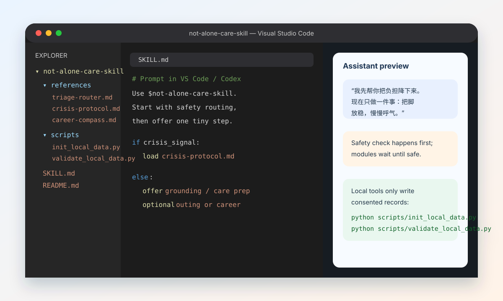
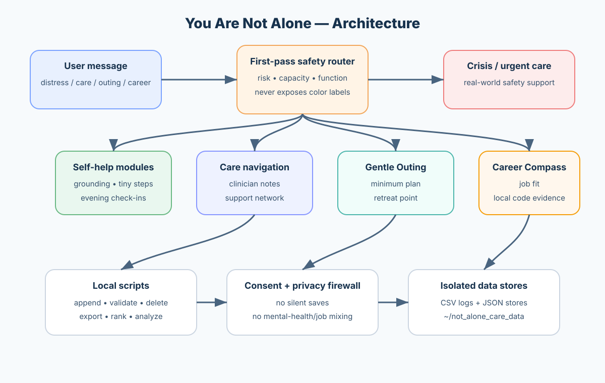
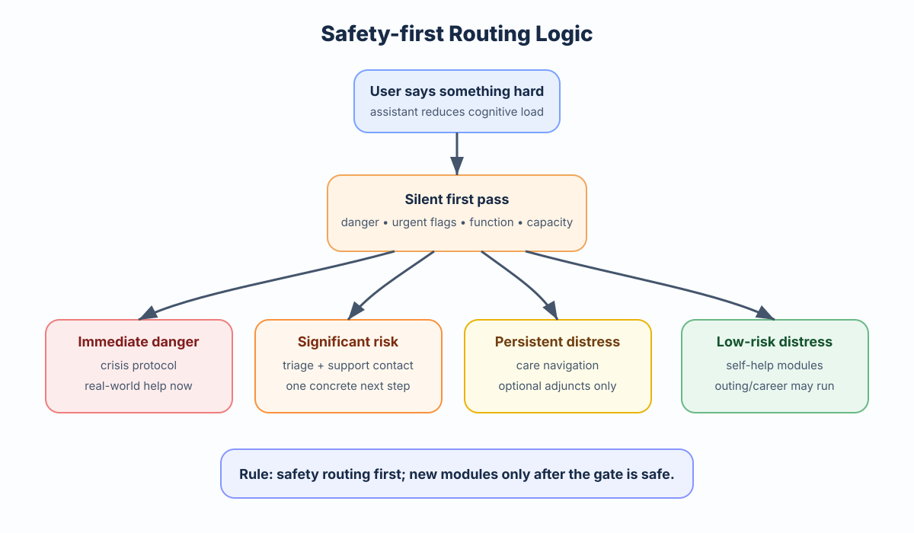

<div align="center">

# You Are Not Alone

<p>
  <strong>Safety-first mental-health support with low-burden routing, crisis navigation, optional outing recovery, and career-direction clarification.</strong>
</p>

<p>
  <a href="LICENSE"></a>
  
  
  
  
</p>

<p>
  <a href="#quick-start">Quick Start</a> |
  <a href="#visual-demo">Visual Demo</a> |
  <a href="#what-it-does">What It Does</a> |
  <a href="#whats-new-in-ver2">What's New in ver2</a> |
  <a href="#demos">Demos</a> |
  <a href="#web-prompt">Web Prompt</a> |
  <a href="#local-data-and-privacy">Local Data and Privacy</a> |
  <a href="#safety-boundary">Safety Boundary</a>
</p>

</div>

---

`not-alone-care-skill` is a mental-health support skill, not a diagnosis or treatment tool.

Core principle: the user should not carry extra cognitive load when distressed. The assistant routes risk first, gives a default low-burden step, and only then introduces optional modules when safe.

It helps an AI assistant respond more carefully when a user reports depression, anxiety, panic, emotional distress, loss of function, loneliness, hopelessness, self-harm thoughts, suicidal ideation, medication concerns, or difficulty seeking care.

The workflow keeps one practical rule: a distressed user should not have to choose the right mode. The assistant quietly checks for risk signals, keeps each response low-burden, and shifts toward self-help, care preparation, support-network drafting, or crisis navigation as needed.

> [!IMPORTANT]
> This project is not a diagnosis tool, not a therapist, and not a replacement for emergency or professional care. If you or someone else may be in immediate danger, contact local emergency services, a crisis line, or a trusted person nearby.

---

## Visual Demo

Use the skill from VS Code/Codex by asking for `$not-alone-care-skill`; the assistant loads the safety-first workflow, keeps the first response small, and only writes local records after explicit consent.



The two diagrams below show the project at a glance: the architecture map explains how references, scripts, and isolated local stores fit together; the safety-routing chart shows why crisis and urgent-care logic always runs before optional outing or career modules.

<p align="center">
  
  
</p>

---

## Confidence, Audit, and Hardening

No mental-health support tool should claim literal 100% certainty. This repository is designed to make confidence factual instead of absolute: safety boundaries are explicit, local writes are consent-gated, tests cover key privacy behaviors, and the scripts can be re-validated after changes.

Recent hardening focus areas:

- CSV log values are escaped before writing so spreadsheet apps do not execute user-provided formulas when logs are opened manually.
- Profile-store updates and deletions require explicit write consent through `scripts/manage_profile_data.py`.
- Date-scoped deletions reject malformed or inverted date ranges before touching local files.
- The recommended confidence loop is: inspect changes, run the test suite, compile scripts, validate any local data directory, then repeat after every functional change.

## What It Does

| Area | What the skill supports |
| :--- | :--- |
| **First response** | Gentle, short replies for low mood, anxiety, shame, loneliness, or overwhelm. |
| **Stabilization** | Grounding, tiny next steps, worry containment, and low-friction evening check-ins. |
| **Crisis-aware routing** | Self-harm, suicidal thoughts, overdose, harm to others, severe confusion, and unsafe situations. |
| **Care preparation** | Notes for doctors, therapists, school services, workplace support, urgent care, or emergency care. |
| **Local memory** | Optional consented logs for mood records, daily summaries, support contacts, and trend summaries. |
| **Web fallback** | A standalone prompt for browser-based LLMs when the local skill is unavailable. |
| **Gentle Outing Planner (ver2)** | Nearby short outings, city micro-trips, and condition-gated cross-city or overnight plans. |
| **Roundtrip Export (ver2)** | POI-rich itinerary export for copy, screenshot, OCR, and local HTML import. |
| **Career Compass (ver2)** | Low-burden career-direction clarification tied to current emotional load. |
| **Job Market Browser (ver2)** | Browser-based job-post collection with explicit consent checkpoints. |
| **Local Code Career Profile (ver2)** | Evidence-based skill profiling from user-authorized local projects only. |

---

## What's New in ver2

- Added two optional recovery modules under the same safety framework: `Gentle Outing Planner`, `Career Compass`.
- Added roundtrip itinerary export pipeline: `scripts/export_roundtrip_itinerary.py`, `scripts/validate_itinerary_export.py`.
- Added career data and analysis pipeline: `scripts/collect_job_posts_browser.py`, `scripts/normalize_job_posts.py`, `scripts/analyze_local_code_profile.py`, `scripts/rank_job_fit.py`, `scripts/manage_profile_data.py`.
- Added strict data-domain isolation: Mental-health CSV logs remain separate from outing/career/job JSON stores.

---

## Quick Start

Use the skill directly:

```text
Use $not-alone-care-skill to provide safety-first mental-health support, then optionally guide low-burden outing or career clarification when appropriate, and save only consented local records.
```

Use the web fallback:

```text
Please follow the uploaded You Are Not Alone Web Prompt. Start with a low-burden check-in and do not ask me to choose a module.
```

Initialize local data:

```bash
python scripts/init_local_data.py
```

Append one consented event entry:

```bash
python scripts/append_event_log.py --field save_consent=true --field session_type=checkin --field mood_score=4 --field anxiety_score=6 --field energy_score=3
```

Summarize recent trends without diagnosis:

```bash
python scripts/summarize_trends.py
```

Validate local data files and schema assumptions:

```bash
python scripts/validate_local_data.py
```

---

## Publish Changes to GitHub

If you are working from a local clone and want to send the current committed changes to GitHub:

```bash
# 1) Confirm what changed and which branch you are on
git status
git branch --show-current

# 2) If no GitHub remote is configured, add one once
git remote add origin git@github.com:<your-user-or-org>/<your-repo>.git

# 3) Push the current branch to GitHub
git push -u origin HEAD
```

If `origin` already exists, skip step 2. To check remotes:

```bash
git remote -v
```

To update this README in the future:

```bash
# Edit README.md, then review and commit it
git diff README.md
git add README.md
git commit -m "Update README"
git push
```

If GitHub rejects the push, verify that you have access to the repository and that your SSH key or personal access token is configured.

---

## Demos

### Demo 1: Core low-burden support

```text
User:
I have been anxious for days and I don't know whether I should see someone.

Assistant:
That sounds exhausting, especially if this has been going on for several days. I cannot diagnose what is happening, but this is absolutely worth bringing to a professional.

If you want, I can help you make a short care note for a doctor or therapist: how long this has lasted, what changed in sleep/appetite, how it affects your day, and what you want to ask.
```

### Demo 2: ver2 gentle outing planning

```text
User:
I feel trapped at home and my head is too full. I cannot think.

Assistant:
You do not need to solve everything right now. Let's make one low-burden environment shift.

Default draft: a 40-minute route with one open-air point, one sit-down point, and an easy return option.
If you can, give me only a rough area (city or district). If not, I can give you a generic safe version first.
```

### Demo 3: ver2 career clarification + job fit

```text
User:
I am not sure what direction to take. Job searching makes me panic.

Assistant:
Let's keep this low-pressure. We can do two tracks in parallel:
1) identify what your current projects already prove,
2) compare that with a small set of real job posts.

You only need to choose one first step: "scan projects" or "check market".
```

### Demo 4: ver2 roundtrip export flow

```bash
# 1) Export POI-rich itinerary assets
python scripts/export_roundtrip_itinerary.py --itinerary itinerary.json

# 2) Validate export quality and sensitive-content rules
python scripts/validate_itinerary_export.py --itinerary itinerary.json --export-dir ~/not_alone_care_data/exports/roundtrip/2026-04-25-example
```

---

## Web Prompt

If local scripting is unavailable, use the standalone web prompt:

- Prompt file: [网页版/not-alone-care-web-prompt.md](网页版/not-alone-care-web-prompt.md)

The web prompt is designed for browser-based LLM usage and avoids pretending it can write local files.

---

## Local Data and Privacy

Default local path:

```text
~/not_alone_care_data/
```

Data domains:

| Domain | Files |
|---|---|
| Mental-health logs | `event_log.csv`, `daily_summary.csv`, `support_contacts.csv` |
| ver2 outing/career/job stores | `outing_preferences.json`, `career_profile.json`, `job_posts_cache.json`, `exports/roundtrip/` |

Privacy defaults:

- Save minimal structured summaries, not raw conversation text by default.
- Ask for consent before saving each record type unless ongoing consent is explicitly configured.
- Validate local mood/function scores, dates, and known fields before writing records.
- Escape CSV cells that could be interpreted as formulas when opened in spreadsheet software.
- Let users inspect, summarize, update, validate, dry-run deletion, or delete records.
- Keep mental-health records isolated from external websites and job platforms unless the user explicitly consents.
- Require explicit consent before saving browser-collected job posts, normalized job caches, or profile-store updates/deletions.
- Do not store absolute local code paths in career profiles unless `--include-path` is explicitly used.

---

## Safety Boundary

This project deliberately avoids clinical overreach.

- Do not diagnose mental disorders.
- Do not replace therapy, medical care, emergency services, or crisis lines.
- Do not advise starting, stopping, increasing, decreasing, or substituting medication.
- Do not provide self-harm methods, lethal means, concealment advice, or detailed harmful plans.
- Do not save local records without consent.
- Do not send mental-health records to external services without explicit consent.
- Do not auto-apply jobs, auto-contact recruiters, or auto-submit personal information.

---

## Repository Layout

<details open>
<summary><strong>View Repository Tree</strong></summary>

```text
not-alone-care-skill/
├── SKILL.md
├── docs/
│   └── assets/
│       ├── vscode-demo.svg
│       ├── architecture-map.svg
│       └── safety-routing.svg
├── agents/
│   └── openai.yaml
├── references/
│   ├── triage-router.md
│   ├── crisis-protocol.md
│   ├── crisis-resources.md
│   ├── self-help-modules.md
│   ├── care-navigation.md
│   ├── support-network.md
│   ├── tone-controller.md
│   ├── stable-companion.md
│   ├── evening-checkin.md
│   ├── privacy-and-consent.md
│   ├── long-term-memory.md
│   ├── localization.md
│   ├── outing-planner.md
│   ├── outing-roundtrip-export.md
│   ├── career-compass.md
│   ├── job-market-browser.md
│   ├── local-code-career-profile.md
│   └── external-data-privacy.md
├── scripts/
│   ├── _local_data.py
│   ├── _privacy_patterns.py
│   ├── init_local_data.py
│   ├── append_event_log.py
│   ├── append_daily_summary.py
│   ├── manage_support_contacts.py
│   ├── summarize_trends.py
│   ├── delete_log_entries.py
│   ├── validate_local_data.py
│   ├── check_crisis_resource_dates.py
│   ├── export_roundtrip_itinerary.py
│   ├── validate_itinerary_export.py
│   ├── collect_job_posts_browser.py
│   ├── normalize_job_posts.py
│   ├── analyze_local_code_profile.py
│   ├── rank_job_fit.py
│   └── manage_profile_data.py
├── tests/
│   └── test_scripts.py
└── 网页版/
    └── not-alone-care-web-prompt.md
```

</details>

---

## Suggested GitHub Topics

<details>
<summary><strong>View Suggested Topics</strong></summary>

```text
mental-health
mental-health-chatbot
llm
ai-companion
crisis-support
suicide-prevention
anxiety
depression
self-help
prompt-engineering
local-first
privacy
career-guidance
travel-planning
```

</details>

---

## License

MIT License. See [LICENSE](LICENSE).
